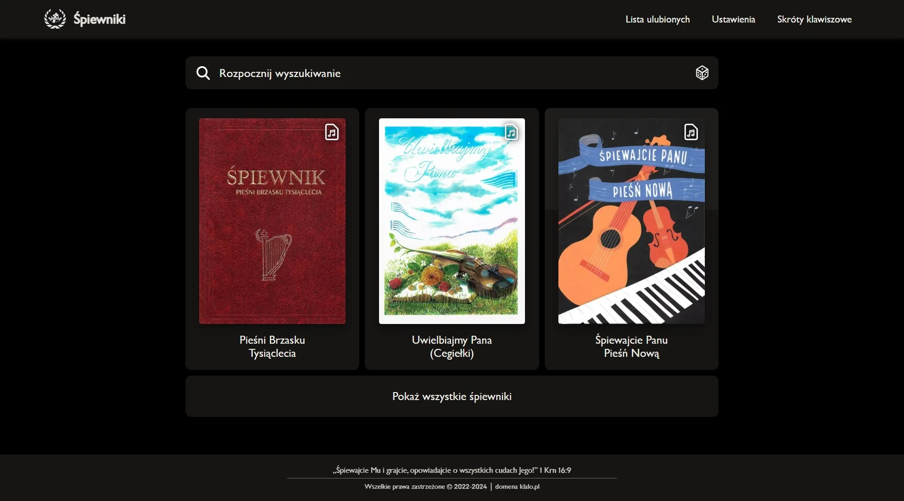

# Śpiewniki

     

## 📖 Project Description

A comprehensive frontend application using PWA technology to display religious hymns and songs on any screen resolution with offline functionality through advanced caching.

### ⚡ Technologies

- **Framework**: [Next.js](https://nextjs.org/docs/14/getting-started) with Pages Router (`/pages`)
- **Package Manager**: [pnpm](https://pnpm.io/)
- **PWA**: Offline-first approach with service worker
- **Styling**: Sass/SCSS with CSS modules
- **TypeScript**: Full application typing

### 🚀 Features

- 📱 Responsive design for all devices
- 🔄 Offline functionality (PWA)
- 🎵 Display of religious hymns and songs
- 📚 Support for multiple hymnals
- ⭐ Favorites system
- 🎨 Multiple color themes
- 📄 PDF document support
- 🔍 Hymn search functionality

###

## ☕ Project Support

If this project has been helpful to you, you can buy me a coffee as a thank you for the work invested.

<strong>Thank you for any support! 🙏</strong>
