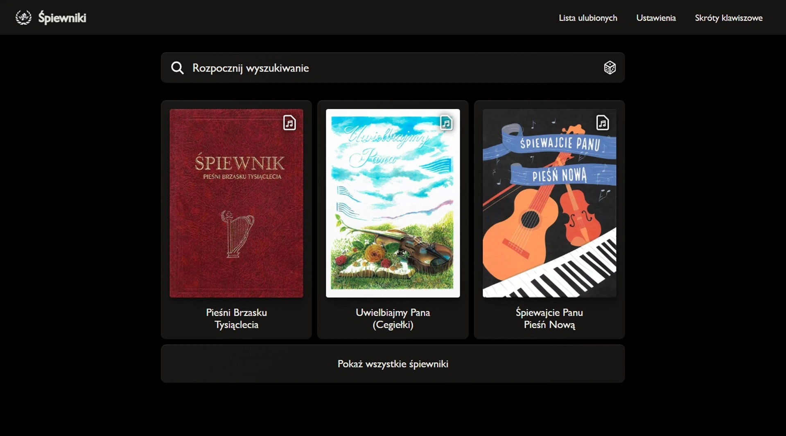

<h1>spiewniki-next</h1>

  
  
  
  
  
  
  
  
  

 

  
Full frontend application using PWA to comprehensively display religious hymns and songs on any screen resolution without internet access caching.

  <ul>
    <li>Using <a href="https://nextjs.org/docs">Next.js</a> framework with Pages Router ( /pages )</li>
    <li>Build by <a href="https://pnpm.io/">pnpm</a> package manager</li>
  </ul>

 

<h2>Support</h2>

